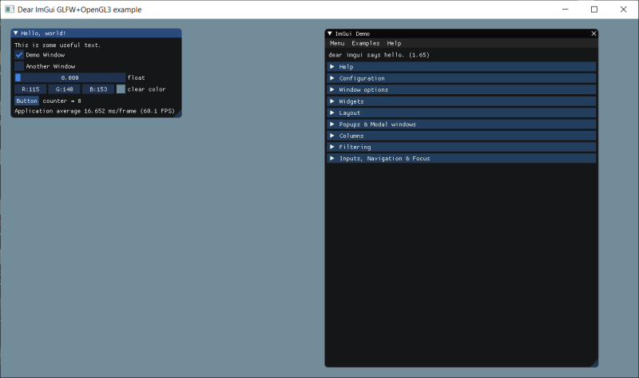

[](../../actions)

# OpenGLGP

Najszybszym sposobem na zaczęcie przygody z OpenGL jest pobranie projektu opartego na CMake, który sam ściągnie odpowiednie biblioteki, dołączy je do projektu i odpowiednio skonfiguruje środowisko programistyczne. 

Zanim zaczniemy będą nam potrzebne takie rzeczy jak:

* Zainstalowane IDE (środowisko programistyczne) Visual Studio 2019, CLion lub inne.
* Zainstalowany program [CMake](https://cmake.org/download/) (należy pamiętać, aby podczas instalacji, dodać CMake do zmiennej PATH).
* Zainstalowany program [Git](https://git-scm.com/downloads).

Kiedy jesteśmy już zaopatrzeni w ww. narzędzia, możemy ściągnąć lub sklonować repozytorium OpenGLGP.

**UWAGA**: Użytkownicy systemu **Windows 10/11** powinni upewnić się, czy mają włączony **Tryb programisty (Developer Mode)**.

Aby zbudować projekt, wchodzimy do folderu _OpenGLGP_ i wywołujemy następujące polecenie:
```
cmake -B Build
```

To polecenie stworzy w folderze Build solucję Visual Studio 2019 (zakładając, że działamy na komputerze wyposażonym w system Windows i IDE Visual Studio 2019).

By uruchomić projekt za pomocą VS 2019, wchodzimy do folderu _Build_, otwieramy solucję _OpenGLGP.sln_. Następnie, klikamy prawym przyciskiem myszy na projekcie _OpenGLGP_ i wybieramy opcję _Ustaw jako projekt domyślny / Set as a startup project_. Następnie budujemy i uruchamiamy aplikację.

Jeżeli korzystamy z IDE Clion (jest darmowa licencja dla studentów) lub Visual Studio 2019 Community, wystarczy wybrać w nim opcję otwarcia projektu, i z folderu OpenGLGP wybrać plik _CMakeLists.txt_. Następnie Clion / Visual Studio 2019 sam uruchomi skrypt CMake i pobierze odpowiednie biblioteki. Możemy teraz zbudować i uruchomić projekt.

W obu przypadkach powinno pojawić się okienko, w którym renderowane jest przykładowe GUI za pomocą biblioteki ImGUI. 

__Dokumentacja__ ImGUI znajduje się w pliku _thirdparty/imgui/imgui.cpp_.

Widok poprawnie zbudowanej i uruchomionej przykładowej aplikacji:

